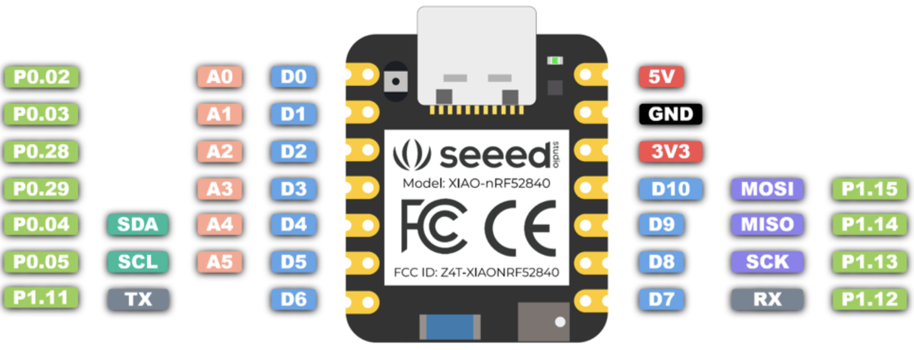

# Seeed Xiao nrf52840

* [Seeed Store](https://www.seeedstudio.com/Seeed-XIAO-BLE-Sense-nRF52840-p-5253.html) 

## Datasheets

* [nRF52840](https://files.seeedstudio.com/wiki/XIAO-BLE/Nano_BLE_MCU-nRF52840_PS_v1.1.pdf)
* [IMU LSM6DS3TR-C](https://files.seeedstudio.com/wiki/XIAO-BLE/ST_LSM6DS3TR_Datasheet.pdf)
  * [Driver](https://crates.io/crates/lsm6ds33)
  * [Usage (bogus)](https://lib.rs/crates/ism330dhcx)
* [Microphone](https://files.seeedstudio.com/wiki/XIAO-BLE/mic-MSM261D3526H1CPM-ENG.pdf)
* [Flash 2MBytes (P25Q16H)](https://files.seeedstudio.com/wiki/github_weiruanexample/Flash_P25Q16H-UXH-IR_Datasheet.pdf)
* [Battery Charger](https://files.seeedstudio.com/wiki/XIAO-BLE/BQ25101.pdf)
* [Pad Positioning](figures/xiao-pad-positioning)

# Pins

## Internal:

| Function      | Pin   | Comment |
|---------------|-------|---------|
| LED_RED       | P0_26 | LEDs |
| LED_GREEN     | P0_30 | |
| LED_BLUE      | P0_06 | |
| IMU_PWR       | P1_08 | IMU |
| IMU_SCL       | P0_27 | |
| IMU_SDA       | P0_07 | |
| IMU_INT       | P0_11 | |
| MIC_PWR       | P1_10 | Microphone |
| MIC_CLK       | P1_00 | |
| MIC_DATA      | P0_16 | |
| BATT_EN       | P0_14 | Battery Charger |
| VBATT         | P0_31 | |
| CHARGE_STATUS | P0_17 | |
| CHARGE_RATE   | P0_13 | |

## Schematic Diagrams

* [Processor](figures/xiao-schematic-processor.pdf)
* [Peripherals](figures/xiao-schematic-peripherals.pdf)

